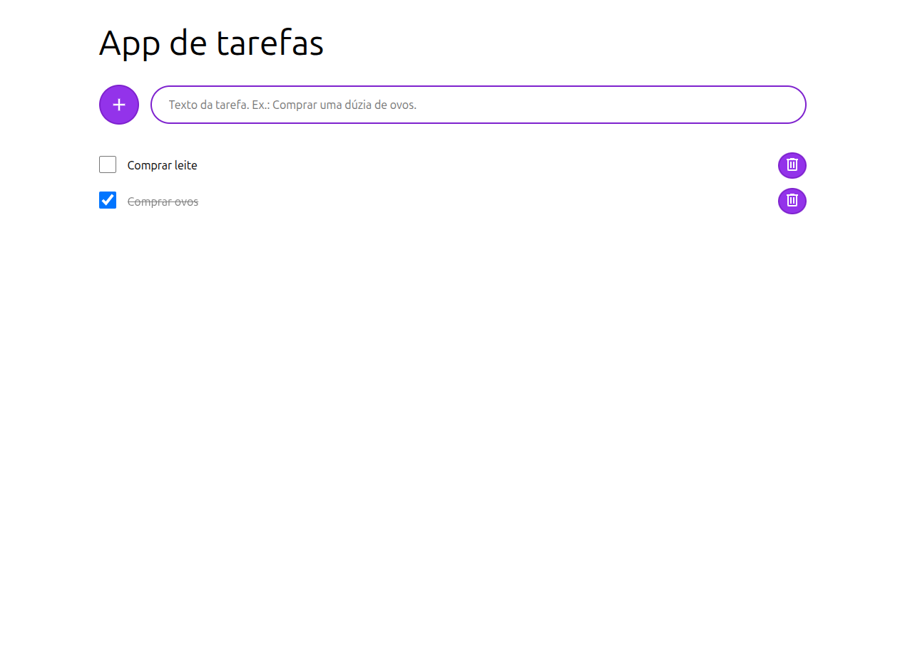

# WebApp de Lista de Tarefas (To-Do List)

Um aplicativo web simples e eficiente para gestão de tarefas, focado em persistência local e minimalismo. Este projeto foi desenvolvido com foco em praticar a manipulação do DOM e o armazenamento de dados no navegador.

## 📸 Captura de Tela



## 📋 Sobre o Projeto

Este projeto consiste num *webapp* de lista de tarefas onde todos os dados são armazenados no `LocalStorage` do navegador, garantindo que as informações persistam entre sessões.

### Funcionalidades

* **Criar:** Adicionar novas tarefas à lista.
* **Marcar:** Alternar entre o estado de "por fazer" e "pronta".
* **Deletar:** Remover tarefas permanentemente da lista.

### Notas Técnicas

* **Front-end:** HTML, CSS e JavaScript puros (Vanilla).
* **Estilização:** Uso de *Modern Normalizer* para consistência entre navegadores e utilização extensiva de variáveis CSS para manutenção de temas.
* **Tooling:** Desenvolvido utilizando [Vite](https://vitejs.dev/) como ferramenta de construção e [PNPM](https://pnpm.io/) como gerenciador de pacotes.
* **Limitações:** O projeto não possui funcionalidade de edição de tarefas e a interface possui responsividade básica (otimizada para dispositivos móveis padrão, mas pode apresentar quebras em ecrãs muito pequenos).

## 🛠 Tecnologias Utilizadas


## 🚀 Como rodar o projeto

Certifique-se de ter o [Node.js](https://nodejs.org/) instalado na sua máquina.

1. **Clone o repositório:**
```bash
git clone https://github.com/heitormrosi/webpage-app-de-tarefas-html-css-js.git

```


2. **Entre na pasta do projeto:**
```bash
cd webpage-app-de-tarefas-html-css-js

```


3. **Instale as dependências com o PNPM:**
```bash
pnpm install

```


4. **Inicie o servidor de desenvolvimento:**
```bash
pnpm dev

```
